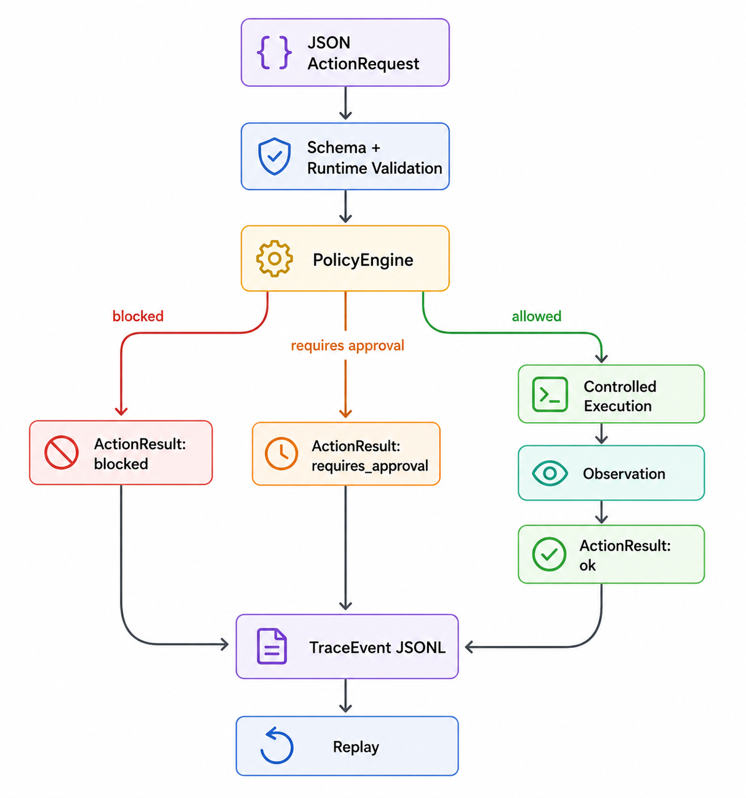

# agent-action-runtime

`agent-action-runtime` is a small Python runtime for executing structured agent actions under explicit policy checks.

It is not an agent framework. It does not call an LLM. It accepts one already-structured action request, validates it, evaluates policy, executes the action if allowed, and returns a structured result.



For runnable examples, see [docs/demo.md](docs/demo.md). For architecture and security boundaries, see [docs/design.md](docs/design.md) and [docs/threat-model.md](docs/threat-model.md).

## What Works

- `read_file`
- `write_file`
- `list_dir`
- `shell`
- workspace-only filesystem access
- sensitive filename/suffix blocking
- shell command allowlist
- destructive shell command blocking
- network shell commands requiring approval
- JSONL trace writing
- trace replay
- CLI entrypoint: `agent-action-runtime`
- pytest coverage for contracts, sandbox, policy, runtime, replay, and CLI

## Install

```bash
python -m venv venv
venv/bin/python -m pip install -e ".[dev]"
```

## Quick Demo

Run one safe action:

```bash
venv/bin/agent-action-runtime run examples/safe_read.json --workspace examples/workspace --json-output
```

The full demo walkthrough, including blocked actions and intentional non-zero exit codes, is in [docs/demo.md](docs/demo.md).

## Action Format

Each action request is JSON:

```json
{
  "run_id": "demo-safe-read-001",
  "tool": "read_file",
  "args": {
    "path": "notes.txt"
  },
  "metadata": {
    "source": "example"
  }
}
```

Required fields:

- `run_id`
- `tool`
- `args`

Supported tools:

- `read_file`
- `write_file`
- `list_dir`
- `shell`

## Policy Behavior

Filesystem actions are checked before execution:

- paths must stay inside the workspace root
- sensitive filenames such as `.env`, `id_rsa`, and `id_ed25519` are blocked on requested and resolved paths
- sensitive suffixes such as `.pem` and `.key` are blocked on requested and resolved paths
- sensitive filenames and suffixes are omitted from directory listings

Shell actions are checked before execution:

- allowlisted commands: `cat`, `head`, `tail`, `wc`
- destructive commands such as `rm` are blocked
- network commands such as `curl` return `requires_approval`
- command operands are checked against the workspace boundary and requested/resolved sensitive-file policy before execution

Policy profiles:

- `default`: current behavior
- `readonly`: allows `read_file` and `list_dir`; blocks `write_file` and `shell`
- `no_shell`: allows filesystem actions; blocks `shell`

CLI exit codes:

- `0`: action completed with `ok`
- `1`: runtime error
- `2`: action was `blocked`
- `3`: action `requires_approval`

## Result Format

Allowed action:

```json
{
  "status": "ok",
  "decision": {
    "status": "allowed",
    "reason": "Filesystem action allowed",
    "policy": "filesystem.allowed",
    "risk_level": "low"
  },
  "observation": {
    "data": {},
    "summary": "Read file: notes.txt"
  },
  "error": null,
  "error_code": null,
  "error_details": {}
}
```

Blocked action:

```json
{
  "status": "blocked",
  "decision": {
    "status": "blocked",
    "reason": "Path escapes workspace root",
    "policy": "filesystem.workspace_escape",
    "risk_level": "high"
  },
  "observation": null,
  "error": "Path escapes workspace root",
  "error_code": "filesystem.workspace_escape",
  "error_details": {}
}
```

## Development

Run tests:

```bash
venv/bin/python -m pytest
```

Run lint and format checks:

```bash
venv/bin/ruff check .
venv/bin/ruff format --check .
```

Run the same core checks as CI:

```bash
venv/bin/ruff check .
venv/bin/ruff format --check .
python -m compileall src tests
venv/bin/python -m pytest
```

## Project Layout

```text
src/agent_action_runtime/
  cli.py
  contracts.py
  context.py
  errors.py
  executors.py
  policy.py
  replay.py
  runtime.py
  sandbox.py
  tracing.py
  validation.py
  filesystem/
    operations.py
    sandbox.py
    sensitivity.py
  shell/
    parser.py
    policy.py
    runner.py

tests/
  test_cli.py
  test_contracts.py
  test_policy.py
  test_replay.py
  test_runtime.py
  test_sandbox.py

examples/
  safe_read.json
  safe_write.json
  safe_list_dir.json
  safe_shell.json
  blocked_path_escape.json
  blocked_sensitive_file.json
  blocked_shell_destructive.json
  blocked_shell_path_escape.json
  blocked_shell_sensitive_file.json
  shell_requires_approval.json
  trace_demo.jsonl
```

## Security Limits

This is a policy-controlled runtime, not a hardened OS sandbox.

The shell runner uses `subprocess.run(..., shell=False)`, a workspace working directory, a fixed trusted `PATH`, an allowlist, timeout limits, output limits, and operand path checks. It does not provide container isolation, syscall filtering, user isolation, network isolation, or a complete shell language sandbox.

The workspace boundary applies to action-controlled paths. `trace_path` is operator-provided runtime context and may point outside the workspace.

Use it as a small, testable control layer, not as a security boundary for hostile code.

## Current Scope

V1 is intentionally small:

- one run executes one action request
- no LLM calls
- no agent loop
- no web UI
- no database
- no plugin system
- no network execution without approval
